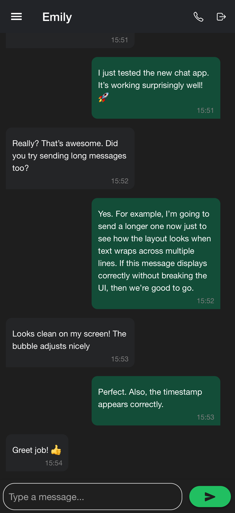
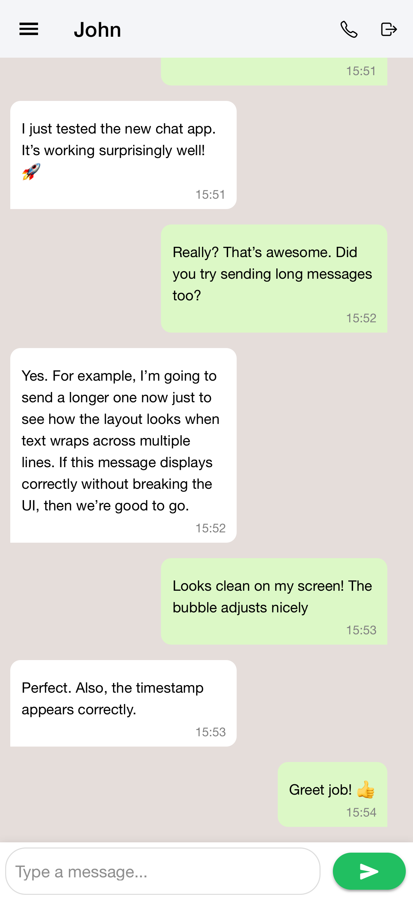
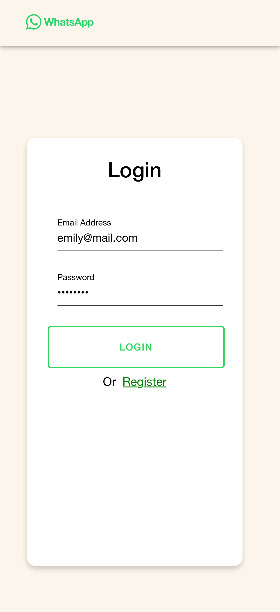
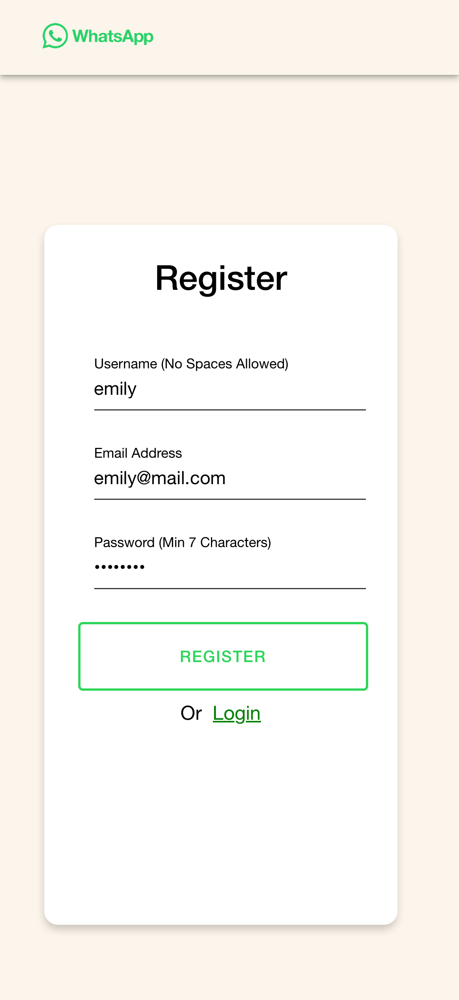
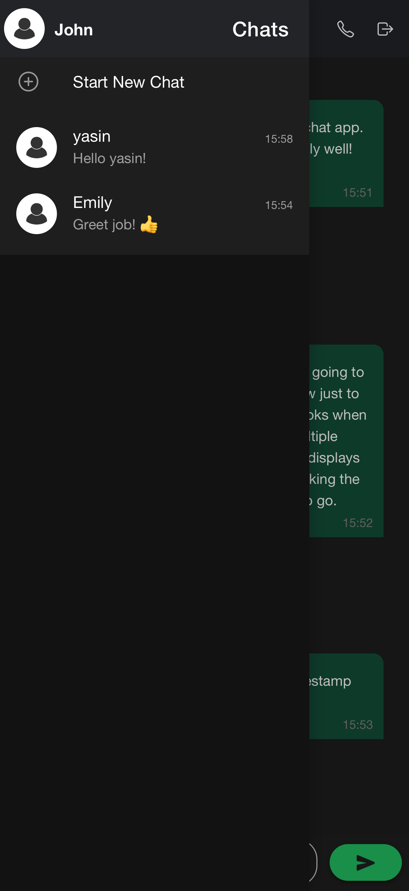

# IonChat

IonChat is a simple real-time chat application built with **Ionic Angular** and **Firebase**. It allows users to register, log in, start one-on-one conversations, and send messages instantly using Firebase Realtime Database.

This project is intended as a lightweight example for developers who want to learn how chat apps work using Ionic and Firebase.

---

## Screenshots

<div align="center">
  <table>
    <tr>
      <td align="center" style="padding:10px;">
        <br/>
        <sub><strong>Dark Theme</strong></sub>
      </td>
      <td align="center" style="padding:10px;">
        <br/>
        <sub><strong>Light Theme</strong></sub>
      </td>
      <td align="center" style="padding:10px;">
        <br/>
        <sub><strong>Login Page</strong></sub>
      </td>
      <td align="center" style="padding:10px;">
        <br/>
        <sub><strong>Register Page</strong></sub>
      </td>
      <td align="center" style="padding:10px;">
        <br/>
        <sub><strong>User Chats</strong></sub>
      </td>
    </tr>
  </table>
</div>


---

## Features
- User registration and login (Firebase Authentication)
- Real-time messaging (Firebase Realtime Database)
- Chat list with last message preview
- Start a new chat with any registered user
- Mobile-friendly UI using Ionic components
- Message send sound effect

---

## Tech Stack
- **Framework:** Angular 18, Ionic 8
- **Backend:** Firebase (Auth + Realtime Database)
- **Mobile Runtime:** Capacitor 6
- **Language:** TypeScript

---

## Installation

### 1. Clone the project
```bash
git clone <REPO_URL>
cd IonChat
````

### 2. Install dependencies

```bash
npm install
```

### 3. Configure Firebase

Edit the file:

```
src/environments/environment.ts
```

Example:

```ts
export const environment = {
  production: false,
  firebaseConfig: {
    apiKey: "<YOUR_API_KEY>",
    authDomain: "<YOUR_AUTH_DOMAIN>",
    databaseURL: "<YOUR_DATABASE_URL>",
    projectId: "<YOUR_PROJECT_ID>",
    storageBucket: "<YOUR_STORAGE_BUCKET>",
    messagingSenderId: "<YOUR_SENDER_ID>",
    appId: "<YOUR_APP_ID>"
  }
};
```

### 4. Run the app

```bash
npm start
```

---

## Usage

1. Register an account
2. Log in
3. Select a user to start chatting
4. Send and receive messages in real time

---

## Project Structure

```
src/
  app/
    login/       # Login page
    register/    # Register page
    home/        # Chat interface
    services/    # Firebase service
  assets/        # Images, sounds
  environments/  # Firebase config
```

---

## Database Architecture (Firebase Realtime DB)

| Node       | Purpose                      | Structure (Key Fields)                                                                 |
|------------|------------------------------|-----------------------------------------------------------------------------------------|
| users      | Stores registered users      | `userId → { username, email, password }`                                                |
| chats      | Chat sessions between users  | `chatId (userA_userB) → { createdAt, messageKey: { message, sender, timestamp } }`     |
| messages   | Global message log (optional)| `messageKey → { message, sender, receiver, timestamp }`                                 |

---

## Future Ideas (Optional)

* Group chats
* Profile images
* Message read indicators

---

## License

This project is open source and available under the MIT License.
